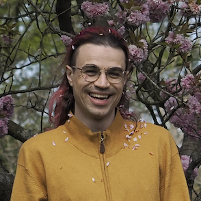
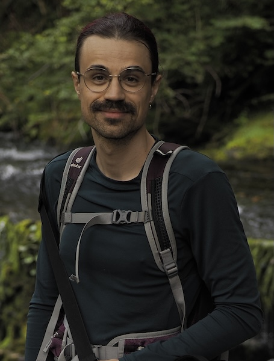
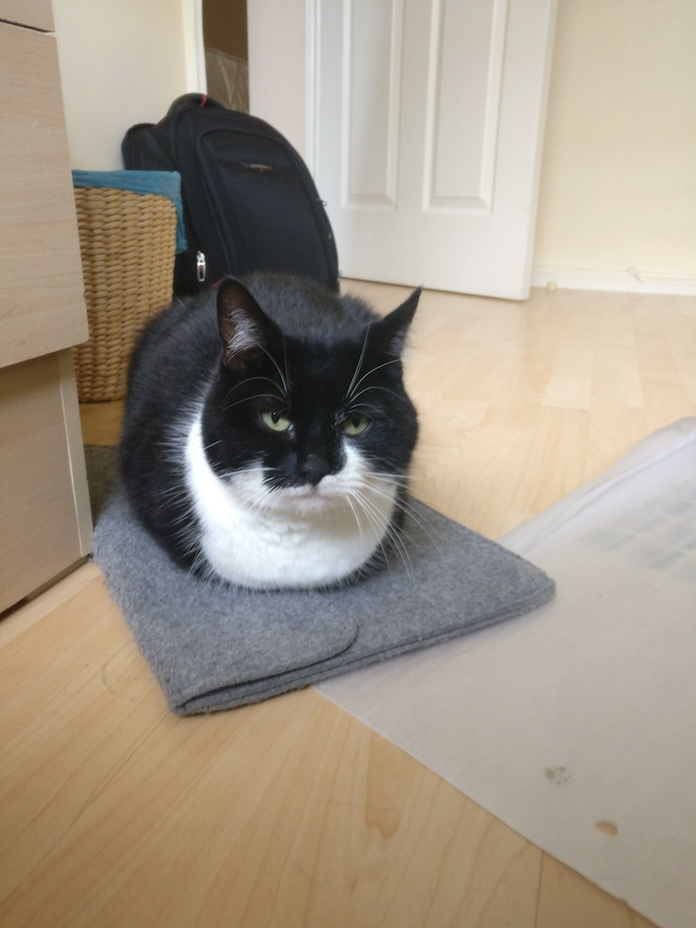
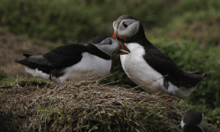

# dr troy kaighin astarte

welcome to the web pages for troy kaighin astarte. (it is meant to look like this.)

maybe you came here for my email. it's <t.k.astarte@swansea.ac.uk>. 
or if you are writing about annals, it's <t.astarte@ieee.org>.

maybe you want to see what I look like? this:\
\
taken in may 2025 at kew gardens by [amber cooper davies](https://ambercooperdavies.com/ "she's an illustrator").

or maybe for my [publications](#publications)?

or a cv? that's not here yet. sorry.

current taught students: info on meeting me at [/students](students.html).

---

## navigation

- [dr troy kaighin astarte](#dr-troy-kaighin-astarte)
  - [navigation](#navigation)
  - [about me](#about-me)
  - [publications](#publications)
  - [supervision](#supervision)
  - [pictures](#pictures)

---

## about me

troy kaighin astarte is (for now) a lecturer in computer science at [swansea university](https://www.swansea.ac.uk/staff/t.k.astarte/). troy graduated with a degree in computer science and a phd in the history of computer science from newcastle university. their research is in the history of computing and computer science, with previous work on the history of programming language semantics and concurrency. troy's teaching is in various areas of computing with a focus on shaping a more socially-aware generation of graduates. 

at swansea, they are a member of the educational, historical, and philosophical foundations of computer science research group ([ehp](https://www.swansea.ac.uk/compsci/research-and-impact/educational-historical-philosophical-foundations/ "ehp research group page")), the robert recorde centre for fundamental studies, the centre for digital arts and humanities ([codah](https://codah.swansea.ac.uk/ "codah web pages")), the [computer science theory group](https://swansea-theory.github.io/ "theory group web pages"), the [fit lab](http://fitlab.eu "fit lab web page"), and the [history of computing collection](http://hocc.swansea.ac.uk "history of computing collection pages"). 

outside swansea, troy is the editor-in-chief of [ieee annals of the history of computing](http://computer.org/annals "annals"), a member of the   [ieee cs history committee](https://www.computer.org/volunteering/boards-and-committees/history "ieee cs history"), and [acm history committee](http://history.acm.org "acm history committee").

as an agender person (pronouns: [they/them](https://pronouns.alysbrooks.com/they/.../themself "pronoun use guide")) troy appreciates gender-neutral terms of address. this is why the bio is written in the third person. they like to be called ‘troy’ or if more formality is needed, ‘dr. troy’. please, not ‘professor’ or ‘sir’.

[return to top](#dr-troy-kaighin-astarte)

---

## publications 

if you want bibtex of any publication, they are all here: [tkastarte.bib](res/tkastarte.bib "download bibtex of my publications").

i decided most people probably don't care that much about every talk, tech report versions, proceedings edited, reviews, and the like. 
you can find most of them in the above-linked bib if you really want. 
i haven't included the journal editorials. 

some pdfs are hosted here, typically if they are not available anywhere else. if you see this page and really want a different pdf, [email me](#dr-troy-kaighin-astarte "email address was at the top, remember?").

Troy Kaighin Astarte. Conceptualising programming language semantics. *Philosophies*, 10(4):90 2025. <https://doi.org/10.3390/philosophies10040090> (OA).

Troy Kaighin Astarte. Tense & temporality: Computers and the logic of time. In Arianna Borrelli and Helena Durnova, editors, *Computing Practices and Knowledge Cultures*. meson press, 2025. Forthcoming. [pdf](res/pdf/Astarte2025TL.pdf "i should remove this once it's published").

Troy Kaighin Astarte. From monitors to monitors: an early history of concurrency primitives.
*Minds and Machines*, 34:51–71, 2023. <https://doi.org/10.1007/s11023-023-09632-2> (OA).

Troy Kaighin Astarte. “Difficult things are difficult to describe”: The role of formal semantics
in European computer science, 1960–1980. In Janet Abbate and Stephanie Dick, editors, *Abstractions
and Embodiments: New Histories of Computing and Society*. Johns Hopkins University Press, August 2022. [pdf](res/pdf/Astarte2022Difficult.pdf "i see no other online access so here it is").

Troy Kaighin Astarte. Formalising Meaning: a History of Programming Language Semantics.
PhD thesis, Newcastle University, June 2019. <https://cronfa.swan.ac.uk/Record/cronfa59379>. [pdf](res/pdf/Astarte2019PhD.pdf) (big!).

Cliff B. Jones and Troy Kaighin Astarte. Challenges for semantic description: comparing responses from the main approaches. In Jonathan P. Bowen, Zili Zhang, and Zhiming Liu, editors, *Proceedings of the Third School on Engineering Trustworthy Software Systems*. LNCS 11174. Springer, 2018. <https://doi.org/10.1007/978-3-030-02928-9_6>. [pdf](res/pdf/JonesAstarte2018Challenges.pdf).

Troy Kaighin Astarte and Cliff B. Jones. Formal Semantics of ALGOL 60: Four Descriptions in their Historical Context. In Liesbeth De Mol and Giuseppe Primiero, editors, *Reflections on Programming Systems - Historical and Philosophical Aspects*. Springer, 2018. <https://doi.org/10.1007/978-3-319-97226-8_4>. [pdf](res/pdf/AstarteJones2018ALGOL.pdf).

[return to top](#dr-troy-kaighin-astarte)

---

## supervision 

i currently supervise the following research students. (they wrote these short descriptions). 

[genevieve clifford](https://mun-tonsi.net) (from 2024, expected finish 2027). genevieve explores what digital poverty means for transgender people in wales by characterising the utility of digital technologies, as well as the political economies that surround them and the transgender people that use them. her work is phenomenological, and centres the stories and experiences of trans people, and practitioners supporting their use of technology. her research interests lie unexpectedly in social construction (and critique) of technology, transgender studies (particularly sociological and philosophical aspects), and luddism in the modern age. genevieve's phd is funded by the [welsh graduate school for the social sciences](https://wgsss.ac.uk/profile/genevieve-clifford).

steven abbot-williams (from 2024, expected finish 2027). Steven's work investigates the intersections between data, sport, and people. Focusing primarily between the late 19th and early 20th centuries, he looks at how those working within sport viewed and utilised data, and what it meant to them. His work looks at how data is socially constructed via differing factors that in turn lead into real tangible events that have their own causal abilities. He also is interested in the groups of people that are responsible for this construction and how they operate in a larger network of various other actors all working in a similar world. 

[return to top](#dr-troy-kaighin-astarte)

---

## pictures

me: taken in early august 2025 by kate mee\

misty: taken at my old house like ten years ago by me\

puffins: taken on skomer island by me and choppily gif'd\

[return to top](#dr-troy-kaighin-astarte)